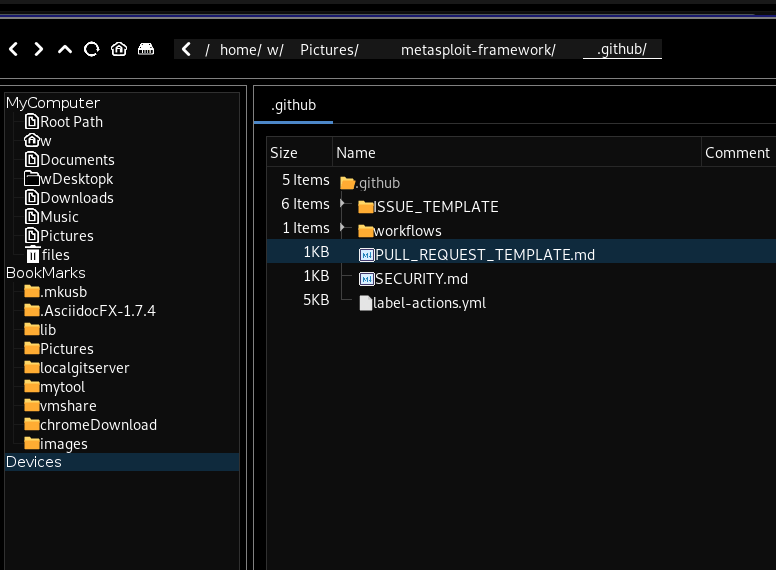

# swingFIleManager
A beautiful file manager based on javaSwing(一个好看的javaSwing编写的文件浏览器)


# note
The current version only supports linux system, because the author uses linux system, and may support other systems in the future, just need to modify a little code, but I don't have so much time and energy recently,

目前版本只支持linux系统,因为作者使用linux系统,未来可能会支持其它系统,仅仅需要修改一点点代码即可,但是我最近没有那么多的时间和精力


## feature
### Single-window mode and multi-window mode
- Single-window Start a single window when starting the jvm（default）启动程序的时候自动启动一个窗口,当窗口被关闭则进程退出
- When the jvm is started, the window is not started by default. When the user requests http://127.0.0.1:64213/newWindow", a window is automatically created, allowing multiple windows to exist,use arg api "java17_home/bin/java -jar  filemanager-1.0-SNAPSHOT.jar  api ".  启动程序的时候不启动任何窗口,请求http://127.0.0.1:64213/newWindow自动创建窗口,

下面图片显示不出来是被墙了,githubusercontent.com国内有时候访问不了
### list 


### multi-panel view


### sftp remote manager


### terminal 


### compression


### popmenus


### Image/Video Thumbnail
 

### copy&move


### bookmarks


### deepsearch

### buttongroup


### autoSync(only localFileSystem)


## hotKeys
- ctrl+t newTab
- ctrl+w close now selected Tab
- ctrl+v copy selected
- ctrl+x copy selected
- ctrl+c paste files/dirs
- enter enter in dir
- backspace put seleted dirs/files to trash(only linux)
- ctrl+alt+q back
- ctrl+alt+e go  

# run 
```bash
YOUR_JAVA17HOME/bin/java  filemanager-1.0-SNAPSHOT.jar -jar 
```

# build 

need jdk java17 
```bash
mvn package 
```
